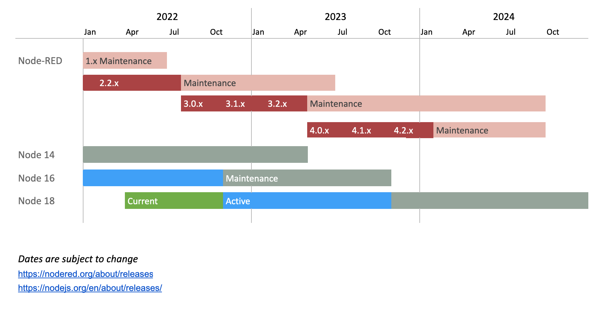

_Updated: 2022-08-04_

この計画は基礎となるNode.jsランタイムのリリーススケジュールを考慮して、
どのようにプロジェクトが今後のリリースをスケジュールしているかをガイドしたものです。

アクティブなNode-RED（3.x系）は3ヶ月ごとに新しいマイナーバージョンアップ（例えば、3.1 ->  3.2）をおこなう予定です。
メンテナンスリリース (例えば、3.1.0 -> 3.1.1) は、
必要になったときに随時おこないます。

2023年4月末にNode 14.xはEOLになり、
Node 14のサポートを終了したNode-RED 4.xを公開する予定です。

そして、3.x系はメンテナンスモードに入ります。
バグ修正およびセキュリティアップデートのみを受け入れます。
4.xからの新機能のバックポートするのは、それをおこなう非常に正統な理由と作業をおこなう人員がいる場合になります。

4.x系は、3ヶ月ごとのマイナーリリースと1年ごとのメジャーリリースに向けて、
アクティブな開発をおこなう予定です。

この案が意味するのは:

 - 定期的なリリースをおこないます - ユーザの手元に新機能を届けます
 - バックログの優先順位付けと計画に役立つスケジュールを持つことになります
 - 明確なEOLがあることでより長期の安定したリリースを提供できます
 - 年に1回、破壊的な変更をおこなえるプランを有することになります

Release | Initial         | Maintenance Start    | End-of-life
--------|-----------------|----------------------|-----------------
1.x     | 2019-09-30      | 2021-04-30           | 2022-06-30
2.x     | 2021-07-22      | 2022-07-14           | 2023-06-30
3.x     | 2022-07-14      | *2023-04-30* *       | 2024-06-30
4.x     | *2023-04-30* *  | *2024-04-30* *       | 2025-06-30

_* 日程は変更になる可能性があります_

参考情報:
 - [Blog post: Going beyond Node-RED 1.x](https://nodered.org/blog/2020/07/01/release-plans)
 - [Node-RED Release Plan source](https://docs.google.com/spreadsheets/d/1swMH5DXVposBIdnm6Q3BvIplMjAZSZVnU_cRS0jAPjY/edit)
 - [Node.js Releases](https://nodejs.org/en/about/releases/)
