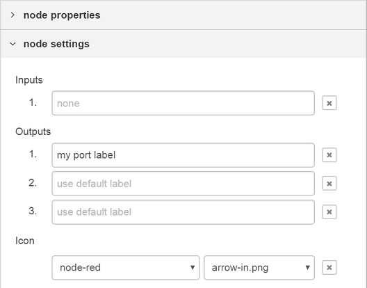

ノードの見た目として、
アイコン、背景色、ラベルの3点を変更できます。

### アイコン

ノードのアイコンは、定義内の`icon`プロパティに指定します。

プロパティの値は、文字列または関数を設定できます。

プロパティの値が文字列の場合は、その文字列をアイコン名として扱います。

プロパティの値が関数の場合は、ノードが最初に読み込まれた時、またはノードが編集された後に評価されます。関数はアイコン名として使う文字列を返すようにしてください。

関数は、ワークスペース上のノード（`this`が参照するノードインスタンス）と、パレット上のノードの両方のアイコンを表示するために使用されます。
パレット上のノード向けの場合、`this`は特定のノードインスタンスを参照しません。
関数は有効な値を返す*必要があります。*


...
icon: "file.png",
...


アイコンは次のいずれかとなります:

 - Node-REDによって用意されたアイコンの名前
 - モジュールによって用意されるカスタムアイコンの名前
 - Font Awesome 4.7のアイコン

#### 用意されたアイコン

<ul class="nr-icon-list">
<li> alert.png</li>
<li> arrow-in.png</li>
<li> bridge-dash.png</li>
<li> bridge.png</li>
<li> db.png</li>
<li> debug.png</li>
<li> envelope.png</li>
<li> feed.png</li>
<li> file.png</li>
<li> function.png</li>
<li> hash.png</li>
<li> inject.png</li>
<li> light.png</li>
<li> serial.png</li>
<li> template.png</li>
<li> white-globe.png</li>
</ul>

**注意**: Node-RED 1.0では、これらすべてのアイコンはより良い表示のためSVGに代替されました。
後方互換を確保するため、可能な場合はエディタが自動的にSVGへのリクエストをpngへのリクエストに置き換えます。

#### Font Awesomeアイコン

Node-REDは[Font Awesome 4.7のアイコン](https://fontawesome.com/v4.7.0/icons/)のフルセットを同梱しています。

Font Awesomeアイコンを指定するには、次のプロパティを指定します:


...
icon: "font-awesome/fa-automobile",
...


#### 独自アイコン

ノードの`.js`ファイルや`.html`ファイルと同じディレクトリに存在する`icons`ディレクトリの中に、ノード固有の独自アイコンを配置します。
アイコンのファイル名を指定すると、エディタは本ディレクトリ内からアイコンを探し出します。
そのため、アイコンのファイル名は一意にする必要があります。

アイコンは、背景を透過色にした40 x 60ピクセルの白い画像にしてください。

#### ユーザ定義アイコン

1つもしくは複数のアイコンファイルを含むインストール済のモジュール名または`node-red`のコアノードの名称が左に表示されます。
モジュールのアイコンファイルの名前が右に表示されます。

ユーザーは、各ノードのアイコンを
エディター内にあるノードの編集ダイアログの'外観'タブでカスタマイズできます。

**注意**: ノードがデフォルトの`icon`プロパティを持っている場合、ノードのアイコンは上書きすることができません。
たとえば、`node-red-dashboard`の`ui_button`ノードなどがそれです。

### 背景色

ノードの背景色は、異なるノードの型を素早く区別するための主な手段の1つです。
ノードの背景色は、ノード定義の`color`プロパティに定義してください。


...
color: "#a6bbcf",
...


Node-REDでは落ち着いた色を採用しています。 
新たなノードは、この色に合うようにしてみてください。

以下は、ノードの背景色として良く使われる色です。:

<ul class="nr-color-list">
<li style="background: #3FADB5">#3FADB5</li>
<li style="background: #87A980">#87A980</li>
<li style="background: #A6BBCF">#A6BBCF</li>
<li style="background: #AAAA66">#AAAA66</li>
<li style="background: #C0C0C0">#C0C0C0</li>
<li style="background: #C0DEED">#C0DEED</li>
<li style="background: #C7E9C0">#C7E9C0</li>
<li style="background: #D7D7A0">#D7D7A0</li>
<li style="background: #D8BFD8">#D8BFD8</li>
<li style="background: #DAC4B4">#DAC4B4</li>
<li style="background: #DEB887">#DEB887</li>
<li style="background: #DEBD5C">#DEBD5C</li>
<li style="background: #E2D96E">#E2D96E</li>
<li style="background: #E6E0F8">#E6E0F8</li>
<li style="background: #E7E7AE">#E7E7AE</li>
<li style="background: #E9967A">#E9967A</li>
<li style="background: #F3B567">#F3B567</li>
<li style="background: #FDD0A2">#FDD0A2</li>
<li style="background: #FDF0C2">#FDF0C2</li>
<li style="background: #FFAAAA">#FFAAAA</li>
<li style="background: #FFCC66">#FFCC66</li>
<li style="background: #FFF0F0">#FFF0F0</li>
<li style="background: #FFFFFF">#FFFFFF</li>
</ul>

### ラベル

ノードのラベルについては、`label`、`paletteLabel`、`outputLabel`、`inputLabel`の4つのプロパティがあります。

#### ノードラベル

ワークスペース内のノードの`label`は静的なテキストにもできますし、
各ノード毎のプロパティに基づき動的に設定することもできます。

プロパティに設定できる値は文字列または関数です。

値が文字列の場合は、それがそのまま使用されます。

値が関数の場合は、ノードが最初にロードされたタイミング、
またはノードが編集された段階で評価されます。
関数はラベルとして利用する値を返却することを期待されています。

前のセクションで言及したとおり、
それぞれのノードを区別しやすくするため`name`プロパティを持つことが通例です。
下記の例は
`label`にプロパティまたはデフォルト値がセットされることを表しています。


...
label: function() {
    return this.name||"lower-case";
},
...


プロパティの[クレデンシャル](credentials)はラベルの関数内では使用できません。

#### パレットラベル

デフォルトでは、ノードの型をパレット上のノード名として使います。
`paletteLabel`プロパティを指定すると、デフォルトのノード名を上書きします。

`label`と同様に、プロパティは文字列または関数とします。
関数の場合は、ノードがパレットに追加されたとき1回評価されます。

#### ラベルスタイル

ラベルのCSSは`labelStyle`を利用して動的に設定できます。
現状では、このプロパティは適用するCSSクラスを特定できなければいけません。
指定されていない場合は、デフォルトの`node_label`が指定されます。
他にあらかじめ定義されているクラスは`node_label_italic`のみです。

    

下記は`name`プロパティが設定されている場合に、
`labelStyle`に`node_label_italic`を設定する例です。


...
labelStyle: function() {
    return this.name?"node_label_italic":"";
},
...


#### 整列

デフォルトでは、アイコンとラベルはノード内の左寄せになっています。
フローの最後となるノードの場合は、慣例では右寄せにします。
これはノードの`align`プロパティに`right`を設定することによって実現されます。


...
align: 'right',
...


    

#### ポートラベル

ポートにマウスオーバーすることで表示されるラベルを入力ポートと出力ポートに設定できます。

    

これらはノードのhtmlファイルで静的に設定できます。


...
inputLabels: "parameter for input",
outputLabels: ["stdout","stderr","rc"],
...


関数の場合は、出力ピンの位置が得られます（indexは0から始まります）。


...
outputLabels: function(index) {
    return "my port number "+index;
}
...


どちらの場合でも、設定エディタの`node settings`でユーザが値を設定すると上書きされます。

    

    

**注意**: ラベルは動的には生成されず、`msg`プロパティで設定することもできません。

### ボタン

ノードには、コアのInjectノードやDebugノードのように、左端または右端にボタンを配置できます。

原則として、エディタはフローを制御するためのダッシュボードではないため、
一般的にはノードにボタンを配置すべきではありません。
InjectノードとDebugノードは、フローの開発という役割を行うという点で特例です。

`button` プロパティはボタンの挙動を定義するために使用されます。
最低限、ボタンがクリックされたときの挙動を`onclick`に定義しなければなりません。


...
button: {
    onclick: function() {
        // Called when the button is clicked
    }
},
...


プロパティには、ノードの現在の設定をベースとして、ボタンの有効無効を動的に切り替えるための
`enabled`を関数定義することもできます。

同様に、ボタンを表示するかどうかを決定するための`visible`関数も定義できます。


...
button: {
    enabled: function() {
        // return whether or not the button is enabled, based on the current
        // configuration of the node
        return !this.changed
    },
    visible: function() {
        // return whether or not the button is visible, based on the current
        // configuration of the node
        return this.hasButton
    },
    onclick: function() { }
},
...


`button`はDebugノードのようにトグルボタンとしても設定することもできます。
まず、ノードの`defaults`オブジェクト内のプロパティを特定するための`toggle`プロパティを追加します。
そして、特定された`defaults`オブジェクト内のプロパティはボタンが押下されているかどうかのboolean値を持ちます。


...
defaults: {
    ...
    buttonState: {value: true}
    ...
},
button: {
    toggle: "buttonState",
    onclick: function() { }
}
...

