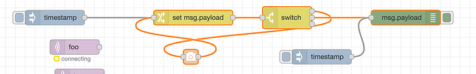
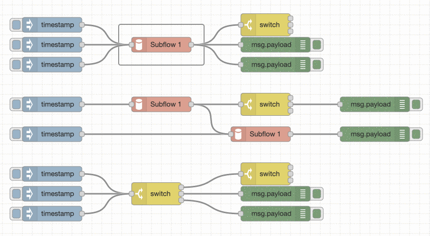
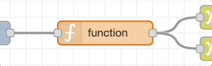
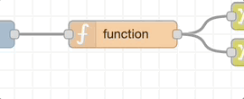

  
  
ノードを繋ぐ

ノードのポートでマウスの左ボタンを押し、目的のノードまでドラッグしてマウスを放すことで、
ノード同士を接続することができます。

また、`Ctrl/Command`キーを押したままにした場合、
ノードのポート上でマウスの左ボタンをクリック（そして放して）目的のノードをクリックすることでも接続できます。
`Ctrl/Command`キーを押したままにし、接続する目的のノードが出力ポートを持っていた場合、
新しいワイヤーはそのノードから開始されます。
これによって一連のノードを素早く繋げることができます。

これもワークスペース上で`Ctrl/Command-Click`によって呼び出される、
クイック追加ダイアログと組み合わせることができ、
素早く新しいノードを追加し、フロー内で前のノードと繋げることができます。

#### ワイヤーに割り込む

入力ポートと出力ポートの両方を持つノードをワイヤーの中間にドラッグした場合、
ワイヤーが破線で描画されます。
このときノードをドロップすると、自動的にその位置でノードが挿入されます。

  
  
ワイヤー上でノードをドロップしてフローの中間に挿入する

#### ワイヤーを動かす

ポートからワイヤーを切断するには、ワイヤーをクリックすることで選択状態にし、
そのポート上でマウスの左ボタンを押したときに`Shift`キーを押し続けます。
そしてマウスをドラッグすると、ポートからワイヤを切断して他のポートにドロップできます。
ワークスペース上でマウスボタンが放された場合、
ワイヤーは削除されます。

もしポートが複数のワイヤーを持っていた場合、
`Shift`キーを押したままボタンを押したときにどのワイヤーも選択されていなければ、すべてのワイヤーが移動します。

#### Selecting multiple wires

You can also select multiple wires by holding <kbd>ctrl</kbd> while clicking on them.

When you select multiple nodes, we also highlight any wires between them. This can make it easier to follow a flow once you have selected it.

  
  
Selecting multiple wires

#### Deleting wires

1. Select one or more wires 
    1. To select a single wire, left click 1 wire.
    1. To select multiple wires, left click 1 wire then while holding <kbd>ctrl/⌘</kbd>, click on the other wires.
1. Press the <kbd>delete</kbd> key

#### Slicing wires
You can also remove wires by slicing through them. You do this by holding the ctrl (or cmd) key, then dragging the mouse with the right-hand button pressed:

  
  
Slicing wires

#### Detaching nodes

##### Delete Node, keep wires
You can delete a node from the middle of a flow and have the wiring automatically repair itself in the background:

  

    
    
Delete Node, keep wires

  

  <table class="action-ref double-column">
    <tr><th colspan="2">Reference</th></tr>
    <tr><td>Action</td><td><code>core:core:delete-selection-and-reconnect</code></td></tr>
    <tr><td>Key shortcut</td><td><kbd>Ctrl/⌘-delete</kbd></td></tr>
  </table>

##### Detach Node from wires
You can also detach a node from the flow without deleting it:

  

    
    
Detach Node from wires

  

  <table class="action-ref double-column">
    <tr><th colspan="2">Reference</th></tr>
    <tr><td>Action</td><td><code>core:detach-selected-nodes</code></td></tr>
    <tr><td>Key shortcut</td><td><code>*Not assigned</code></td></tr>
  </table>

<i>\* There is no default shortcut for **Detach Node from wires**, but you can assign one yourself in the Keyboard pane of the Settings dialog.</i> 
